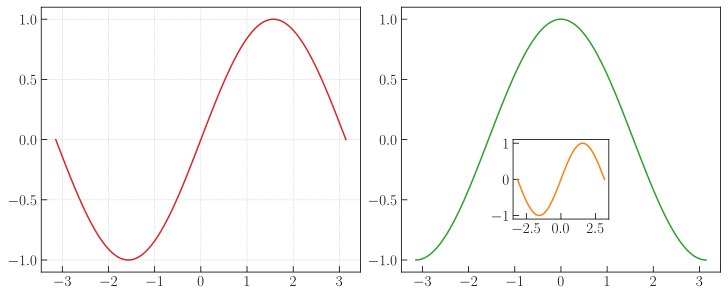
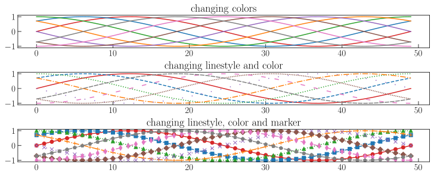
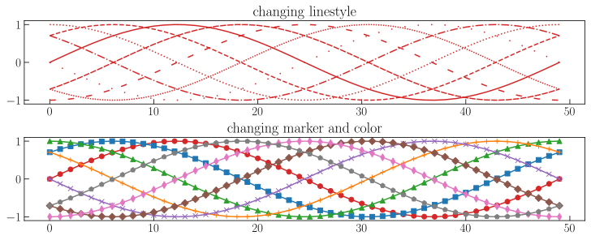

# mplstyle
`matplotlib` plot styles and customizations. A sensible set of defaults for academic use.

## Installation
**Activate your python environment then do:**
```bash
git clone https://github.com/anoopkcn/mplstyle.git
pip install mplstyle
```
## Usage
Import library
```python
from mplstyle import styles
```
Create an object. Note that when you create the object with a specific style template name, this template is applied instead of the matplotlib default

```python
st=styles.Style('academic')
```
Where `academic` is a `mplstyle` template.  To revert back to default `matplotlib` template simply create the object without any arguments

```python
st=styles.Style()
```

Example code 1:
```python
st=styles.Style('academic')

x = np.linspace(-np.pi, np.pi, 100)

fig = plt.figure(figsize=(10, 4))

with mpl.rc_context({"axes.grid": True, "axes.axisbelow": True}):
    ax1 = fig.add_subplot(1, 2, 1)
    ax1.plot(x, np.sin(x))

with mpl.rc_context():
    ax2 = fig.add_subplot(1, 2, 2)
    ax2.plot(x, np.cos(x),color='tab:green')

with mpl.rc_context():
    panel = ax2.inset_axes([0.35,0.2,0.3,0.3])
    panel.plot(x, np.sin(x), color="tab:orange")
```
Output:


Example code 2:

```python
st=styles.Style('academic')

c1 = st.cycle('series_color')
c2 = st.cycle('series_linestyle_color')
c3 = st.cycle('series_linestyle_marker_color')

x = np.linspace(0, 2 * np.pi, 50)
offsets = np.linspace(0, 2 * np.pi, 8, endpoint=False)
yy = np.transpose([np.sin(x + phi) for phi in offsets])

fig = plt.figure(figsize=(10, 4))
with mpl.rc_context({'axes.prop_cycle':c1}):
    ax1 = fig.add_subplot(3, 1, 1)
    ax1.plot(yy)
    ax1.set_title('changing_colors')
with mpl.rc_context({'axes.prop_cycle':c2}):
    ax2 = fig.add_subplot(3, 1, 2)
    ax2.plot(yy)
    ax2.set_title('changing linestyle and color')
with mpl.rc_context({'axes.prop_cycle':c3}):
    ax3 = fig.add_subplot(3, 1, 3)
    ax3.plot(yy)
    ax3.set_title('changing linestyle, color and marker')
```
Output:


Example code 3:
```python
c4 = st.cycle('series_linestyle')
c5 = st.cycle('series_marker_color')

fig = plt.figure(figsize=(10, 4))
with mpl.rc_context({'axes.prop_cycle':c4}):
    ax1 = fig.add_subplot(2, 1, 1)
    ax1.plot(yy)
    ax1.set_title('changing_linestyle')
with mpl.rc_context({'axes.prop_cycle':c5}):
    ax2 = fig.add_subplot(2, 1, 2)
    ax2.plot(yy)
    ax2.set_title('changing marker and color')
```
Output:


## Add more styles

You can add more styles in the `src/mplstyle/templates.py` file

More `cycles` can be added in `src/mplstyle/cycles.py`
